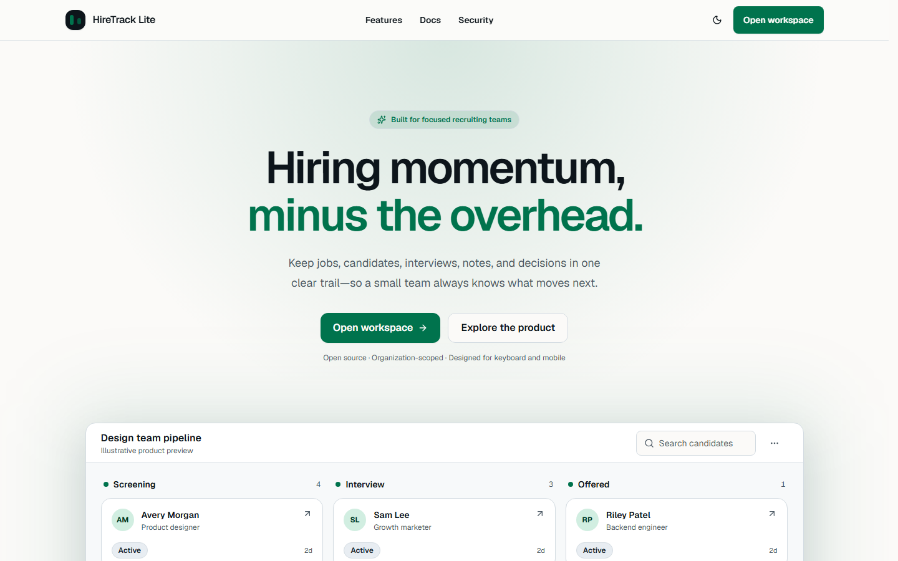

# HireTrack Lite

> A focused applicant tracking workspace that helps small hiring teams move candidates from application to hire without juggling spreadsheets, inboxes, and disconnected calendars.

[](https://github.com/thakurharshsingh914027-del/hiretrack-lite/actions/workflows/ci.yml)
[](LICENSE)
[](tsconfig.json)



**Live preview:** [https://hiretrack-lite.vercel.app](https://hiretrack-lite.vercel.app)

**Repository:** [https://github.com/thakurharshsingh914027-del/hiretrack-lite](https://github.com/thakurharshsingh914027-del/hiretrack-lite)

**Demo access:** The database seed creates a verified demo admin. Credentials remain operator-supplied through server-only environment variables; they are never published in this repository.

HireTrack Lite is designed for small companies that need the essential behavior of an applicant tracking system without enterprise complexity. One organization-scoped workspace brings together jobs, candidates, applications, interviews, notes, activity history, and hiring analytics. The product is currently under milestone-based development; this README distinguishes planned release scope from functionality already implemented.

## Current status

Milestones 1–3 are complete. The repository now includes the runnable Next.js foundation, reviewed PostgreSQL/Prisma data model, Auth.js credentials/OAuth boundary, verified email and recovery flows, organization invitations, protected layouts, live membership/RBAC checks, session-version revocation, mail/rate-limit adapters, real-PostgreSQL integration tests, and PostgreSQL-backed CI. Recruiting mutations remain gated later milestones; the current public deployment is still a pre-release product preview.

## Release scope

The planned v1 will let an authorized hiring team:

- Create, update, close, archive, search, filter, and sort jobs with stable cursor pagination.
- Maintain candidate profiles, skills, private resumes, applications, notes, and interview history.
- Select rows in one cursor window or all matching rows across windows, then confirm a capped bulk action.
- Export the authorized, filtered job or candidate table as CSV or PDF with matching columns and ordering.
- Move applications through an accessible Kanban pipeline with optimistic updates and rollback.
- Schedule and complete interviews with an assigned interviewer, time zone, feedback, and rating.
- Collaborate as an admin, recruiter, or read-only viewer with server-enforced permissions and optional configured Google/GitHub sign-in.
- Inspect organization-scoped pipeline, interview, hiring, and activity analytics backed by live data.
- Invite members, manage roles, and preserve an immutable audit trail for sensitive changes.
- Use the core workflows on mobile, through a discoverable command palette and keyboard shortcuts, in dark mode, and with reduced motion enabled.

The authoritative requirements, acceptance criteria, and milestone gates live in [plan.md](plan.md).

## Screenshots

Real screenshots will be captured from the completed application and added to [`docs/screenshots`](docs/screenshots) after the relevant UI workflows are implemented. A 60–90 second demo recording and 3–5 production screenshots are release deliverables; placeholders are not presented as product evidence.

## Tech stack

| Layer                 | Choice                                                                      |
| --------------------- | --------------------------------------------------------------------------- |
| Application           | Next.js App Router and React                                                |
| Language              | TypeScript in strict mode                                                   |
| UI                    | Tailwind CSS and accessible shadcn/Radix primitives                         |
| Validation            | Zod at forms, server boundaries, queries, files, and environment input      |
| Data                  | PostgreSQL through Prisma with checked-in migrations                        |
| Authentication        | Auth.js credentials/optional OAuth with live database authorization checks  |
| Forms and interaction | React Hook Form, Server Actions, Route Handlers, and focused client islands |
| Charts and pipeline   | Recharts and an accessible drag-and-drop implementation                     |
| Managed adapters      | Vercel Blob, Resend, and Upstash Redis                                      |
| Quality               | ESLint, Prettier, Vitest, Playwright, and GitHub Actions                    |
| Hosting target        | Vercel with managed PostgreSQL                                              |

## Quick start

### Prerequisites

- Node.js 24 LTS
- npm
- PostgreSQL 17-compatible database for migrations, seeds, and integration tests

```bash
git clone https://github.com/thakurharshsingh914027-del/hiretrack-lite.git
cd hiretrack-lite
cp .env.example .env.local
npm ci
```

Set `DATABASE_URL`, `DIRECT_URL`, and a non-placeholder `DEMO_ADMIN_PASSWORD` in `.env.local`, then initialize the database:

```bash
npm run db:validate
npm run db:migrate
npm run db:seed
npm run dev
```

Open [http://localhost:3000](http://localhost:3000). `DATABASE_URL` is the pooled application connection; `DIRECT_URL` is the direct connection used by Prisma migrations. Use `npm run db:migrate:deploy` instead of the development migration command in CI or production.

## Commands

| Command                     | Purpose                                                |
| --------------------------- | ------------------------------------------------------ |
| `npm run dev`               | Start the local development server                     |
| `npm run build`             | Create a production build                              |
| `npm run start`             | Serve the production build                             |
| `npm run db:generate`       | Generate the pinned Prisma Client                      |
| `npm run db:validate`       | Validate the Prisma schema and configuration           |
| `npm run db:migrate`        | Create/apply development migrations                    |
| `npm run db:migrate:deploy` | Apply committed migrations without development prompts |
| `npm run db:seed`           | Reconcile the deterministic demo dataset               |
| `npm run db:studio`         | Inspect the configured development database            |
| `npm run lint`              | Run repository lint rules                              |
| `npm run typecheck`         | Check strict TypeScript types without emitting files   |
| `npm run test`              | Run the automated test suite once                      |
| `npm run test:db`           | Require and run the real-PostgreSQL constraint suite   |
| `npm run test:watch`        | Run unit tests in watch mode                           |
| `npm run test:e2e`          | Run Playwright browser tests against a built app       |
| `npm run format`            | Format supported source and documentation files        |
| `npm run format:check`      | Verify formatting without changing files               |

Run the same quality gate used by CI before opening a pull request:

```bash
npm run format:check
npm run lint
npm run typecheck
npm run test
npm run build
npm run test:e2e -- --project=chromium
```

Database integration tests require an isolated `TEST_DATABASE_URL`. They are skipped by the general test command when no test database is configured, while `npm run test:db` fails fast without one. The suite deletes all HireTrack tables before each test, so the database/schema name must contain `test`; any other disposable target requires the one-run acknowledgement `ALLOW_DATABASE_RESET=true`. A target matching `DATABASE_URL` or `DIRECT_URL` is rejected without that acknowledgement. Remote targets additionally require `ALLOW_REMOTE_DATABASE_TESTS=true`.

Apply committed migrations to the isolated target before the first run by temporarily pointing `DATABASE_URL` and `DIRECT_URL` at `TEST_DATABASE_URL`, then run `npm run db:migrate:deploy` and `npm run test:db`. Never persist `ALLOW_DATABASE_RESET=true` for a development or production database.

## Environment variables

Copy `.env.example` to `.env.local`; never commit populated environment files. Variables for future services are documented now so deployment and clean-clone setup have one contract, but they are introduced into runtime validation only when their feature milestone needs them.

| Variable                     | Visibility   | Purpose                                                                        |
| ---------------------------- | ------------ | ------------------------------------------------------------------------------ |
| `DATABASE_URL`               | Server only  | Pooled PostgreSQL connection used by the application                           |
| `DIRECT_URL`                 | Server only  | Direct PostgreSQL connection used for migrations                               |
| `AUTH_SECRET`                | Server only  | High-entropy Auth.js signing/encryption secret                                 |
| `AUTH_URL`                   | Server only  | Canonical Auth.js callback base URL                                            |
| `AUTH_GOOGLE_ID`             | Server only  | Optional Google OAuth client ID; configured only as a complete pair            |
| `AUTH_GOOGLE_SECRET`         | Server only  | Optional Google OAuth client secret                                            |
| `AUTH_GITHUB_ID`             | Server only  | Optional GitHub OAuth client ID; configured only as a complete pair            |
| `AUTH_GITHUB_SECRET`         | Server only  | Optional GitHub OAuth client secret                                            |
| `NEXT_PUBLIC_APP_URL`        | Browser safe | Absolute canonical application URL for metadata and links                      |
| `NEXT_PUBLIC_REPOSITORY_URL` | Browser safe | Optional public repository URL for the application footer                      |
| `RESEND_API_KEY`             | Server only  | Resend credential for verification and password-reset mail                     |
| `EMAIL_FROM`                 | Server only  | Verified sender identity used by transactional email                           |
| `BLOB_READ_WRITE_TOKEN`      | Server only  | Private Vercel Blob access token for resume storage                            |
| `UPSTASH_REDIS_REST_URL`     | Server only  | Upstash Redis REST endpoint for distributed rate limits                        |
| `UPSTASH_REDIS_REST_TOKEN`   | Server only  | Upstash Redis REST credential                                                  |
| `DEMO_ORGANIZATION_NAME`     | Server only  | Organization name used by the idempotent demo seed                             |
| `DEMO_ADMIN_NAME`            | Server only  | Display name used by the demo admin seed                                       |
| `DEMO_ADMIN_EMAIL`           | Server only  | Verified demo admin email used by the seed                                     |
| `DEMO_ADMIN_PASSWORD`        | Server only  | Operator-supplied demo password; only disposable CI/test values live in source |

See [.env.example](.env.example) for safe development-shaped values and inline setup notes.

## Target architecture and security

The approved release architecture will use React Server Components for authorized reads close to the data source. Typed Server Actions will handle ordinary domain mutations, while Route Handlers will own Auth.js callbacks, private file streams, and streamed CSV/PDF responses. PostgreSQL will be the source of truth; resume bytes will remain in private object storage.

The implemented schema backs every organization-owned relation with an organization key and uses composite foreign keys for tenant-consistent attribution. Partial unique indexes protect active candidates, applications, invitations, and tokens; named checks protect lifecycle timestamps, resumes, interviews, audit summaries, and concurrency versions. Every future protected operation must still resolve the current session and active membership on the server and include the trusted `organizationId` in its query—the database constraints complement, rather than replace, server authorization.

For diagrams, trust boundaries, data relationships, and deployment topology, read [docs/architecture.md](docs/architecture.md). Accepted trade-offs are recorded in [docs/decisions.md](docs/decisions.md), callable boundaries in [docs/api.md](docs/api.md), and original product lessons in [docs/competitive-analysis.md](docs/competitive-analysis.md).

## Roadmap

- [x] Product plan and architecture diagrams
- [x] Repository foundation, design system, command palette, static docs/FAQ, CI, and base UI verification
- [x] PostgreSQL schema, reviewed migrations, tenant constraints, real-database tests, and idempotent demo seed
- [x] Credentials/optional OAuth, email verification, password reset, invitations, protected layout, and RBAC baseline
- [ ] Jobs vertical slice with search, keyset cursors, cross-page bulk actions, archive, and CSV/PDF export
- [ ] Candidates, private resumes, notes, and applications
- [ ] Accessible optimistic pipeline and interview scheduling
- [ ] Live analytics, activity history, accessibility review, and performance hardening
- [ ] Critical-path Playwright and Lighthouse CI gates
- [ ] Final demo credentials, product screenshots, completed case study, demo video, and tagged v1.0.0 release

Progress is recorded under the unreleased section of [CHANGELOG.md](CHANGELOG.md); a task is checked here only after its milestone verification passes.

## Contributing

Contributions should be scoped, tested, and described in terms of user impact. Read [CONTRIBUTING.md](CONTRIBUTING.md) for setup, branch naming, Conventional Commits, and pull request expectations. Please use the provided issue and pull request templates.

## Case study

The portfolio write-up is maintained in [docs/case-study.md](docs/case-study.md). It is intentionally marked pre-release until complete workflows, demo access, real product screenshots, final verification output, and measured results exist.

## Credit

HireTrack Lite originated as a project for the **Digital Heroes Full Stack Developer Trial**, founded by Prasun Anand. The implementation and visual identity are original to this repository.

## License

Licensed under the [MIT License](LICENSE). Copyright © 2026 Harsh.
