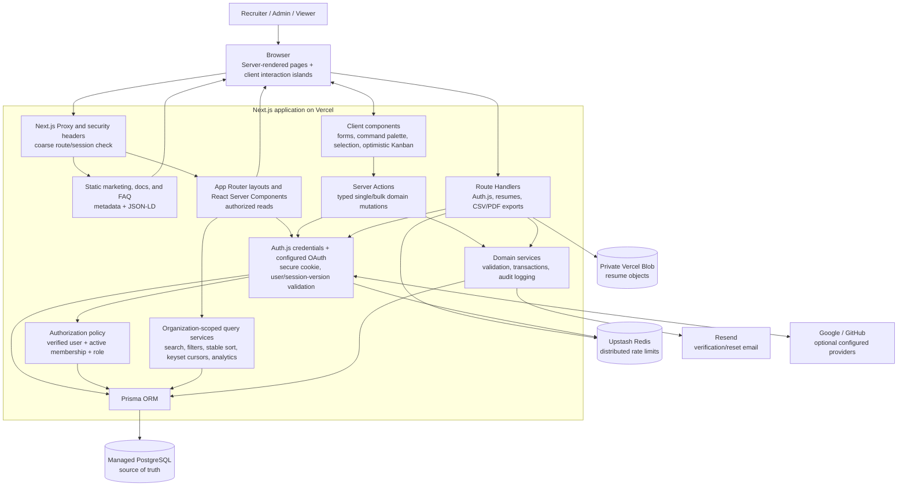
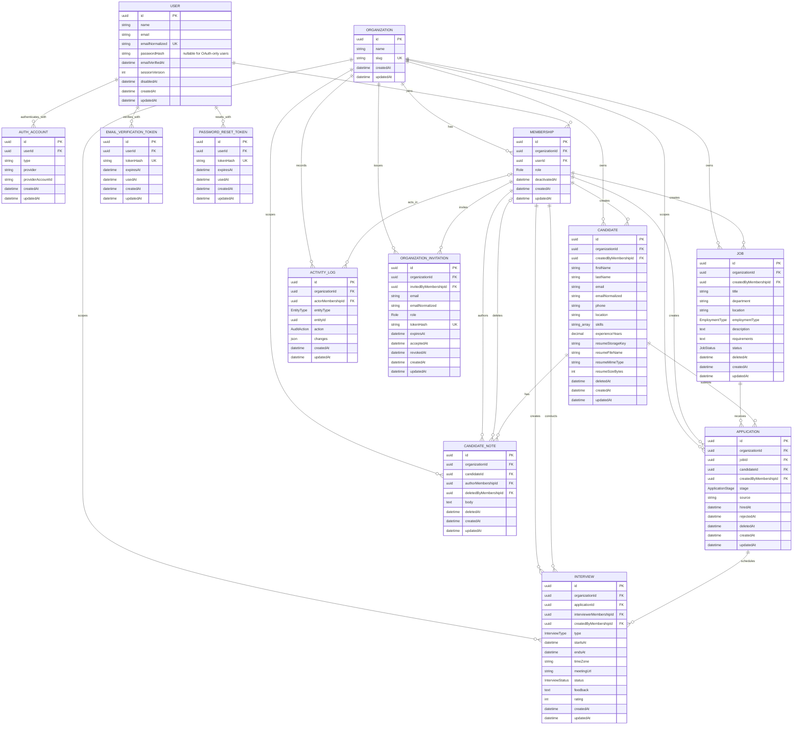
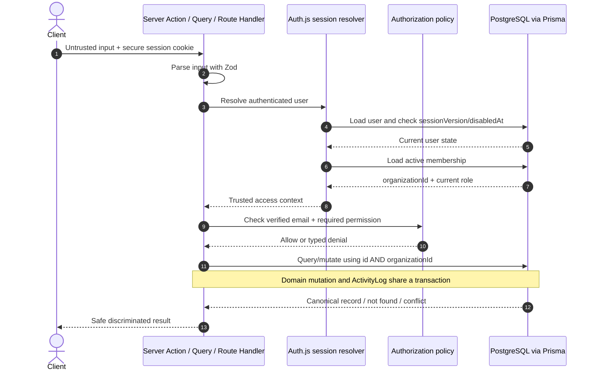
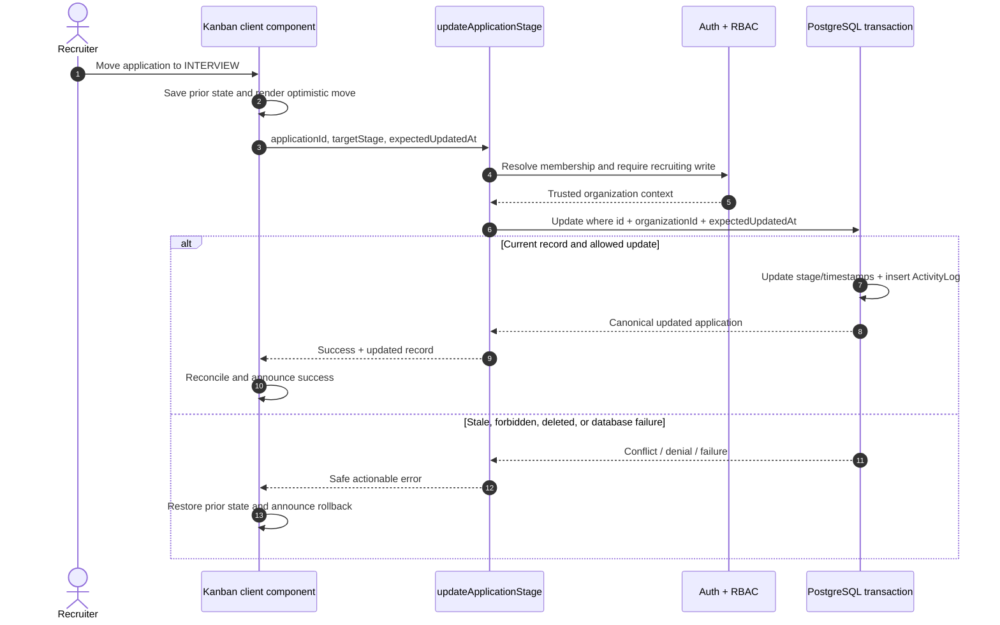
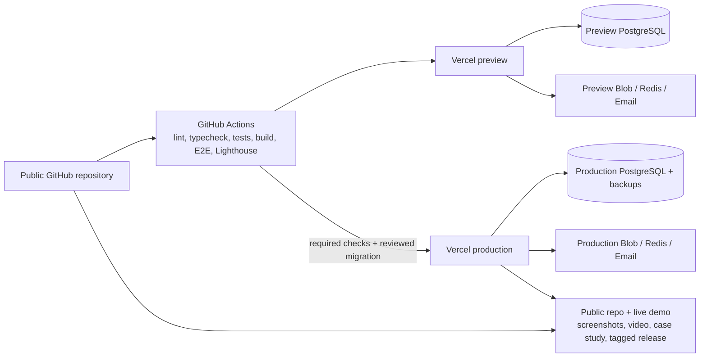

# HireTrack Lite Architecture

Status: **Approved target architecture; implemented incrementally by milestone**

Last updated: 2026-07-13

## Architectural overview

This document is the normative v1 target, not a claim that every boundary already ships. Milestone 1 implements the runnable public foundation, responsive shell, and documentation surfaces; later gated milestones add persistence, authentication, recruiting workflows, exports, and deployment evidence.

The approved release architecture targets a tenant-isolated Next.js application on Vercel. React Server Components will perform authorized reads close to PostgreSQL; focused client components will handle forms, charts, dialogs, commands, cross-cursor selection, and optimistic Kanban interaction. Server Actions will cover ordinary typed and confirmed bulk mutations. Route Handlers will own Auth.js, private file streams, and CSV/PDF downloads. Public documentation and FAQ routes are already statically generated for crawlability and emit visible-content-matched structured data.

PostgreSQL will be the source of truth for recruiting and authorization data. Every protected operation will resolve the authenticated user and load the active organization membership from PostgreSQL. Client-supplied roles, actor IDs, and organization IDs will be ignored. Private object storage will hold resume bytes, while PostgreSQL will store only validated metadata and a private storage key.

## Application architecture diagram

The future Next.js Proxy check will be deliberately coarse and exist for navigation behavior only. It will not be an authorization boundary. Server queries, actions, and handlers will independently enforce authentication, active membership, verified-email requirements, role permissions, and row ownership.

Authorization terminology follows the product brief: `ADMIN`, `RECRUITER`, and `VIEWER` are the persisted roles. This product-specific mapping supersedes generic role labels in the trial PDF without weakening its RBAC requirements.

## Entity relationship diagram

## Data isolation and authorization flow

For a viewer read, the verified-email write gate is not required, but the authenticated active membership and organization predicate remain mandatory. Cross-organization and missing resources use the same outward result where disclosing existence would be unsafe.

Auth.js always exposes credentials sign-in and registers Google/GitHub only when each provider's complete server-only configuration exists. OAuth callbacks require a provider-verified email; first-time OAuth users complete organization onboarding or a matching invitation. A provider email collision does not silently link an existing identity. Credentials/reset attempts are limited independently by privacy-safe IP and normalized-account keys to five attempts per 15 minutes, then exponential backoff applies with an accurate `Retry-After`; missing-account responses retain the same shape and approximate timing. Role changes and membership deactivation increment the affected user's `sessionVersion`, while live membership lookup makes the privilege change effective even before the stale cookie is rejected.

## Optimistic pipeline update

## Trust boundaries and security decisions

- **Browser:** entirely untrusted. It may suggest IDs, stages, filters, and optimistic versions but cannot establish role, tenant, actor, or verification state.
- **Next.js server:** application trust boundary. It validates input, resolves identity, enforces policy, scopes rows, redacts errors, and coordinates transactions.
- **PostgreSQL:** authoritative domain and membership state. Composite/partial unique constraints defend invariants against concurrent requests.
- **Private blob storage:** accepts server-authorized operations only. Random keys prevent meaningful enumeration; authorization is still required for retrieval.
- **Email provider:** receives only the destination and purpose-built link/template data. Raw tokens are never written to application logs.
- **OAuth providers:** untrusted external identity assertions are accepted only through Auth.js callback/state validation and only with a provider-verified email. Provider credentials/tokens remain server-side, and email equality alone never grants account linking.
- **Redis:** stores short-lived rate-limit counters with privacy-conscious keys, not business records.

The main defense-in-depth invariant is that a protected resource is never fetched by record ID alone. Its query includes trusted `organizationId`, active/deleted conditions, and any domain constraint required by the operation.

## Rendering and state strategy

- Server Components load authenticated list/detail/dashboard data and minimize browser bundles.
- URL search parameters are the canonical list state for query, filters, sort, one opaque `after`/`before` cursor, and `limit`; any query-shaping change resets the cursor.
- Interactive filters update the URL after a debounce; navigation causes a fresh organization-scoped server read.
- Mutable table reads use indexed keyset predicates over the selected stable sort tuple plus `id`, fetch `limit + 1`, and return next/previous cursors. Cursor payloads are versioned and tied to the normalized query so malformed, tampered, or stale-query cursors fail validation instead of falling back to offset pagination.
- Table selection has two explicit modes: selected IDs in the loaded cursor window, or all records matching the normalized filter with explicit exclusions. Confirmed bulk mutations rebuild and tenant-scope that predicate on the server, recheck role/state, enforce a cap, process bounded transactions, and return affected/skipped counts; a client-provided count is never authoritative.
- React Hook Form and shared Zod schemas manage complex forms. Server validation remains authoritative.
- Client state is limited to ephemeral interaction state: open dialogs, pending forms, current selection descriptors, command-palette/shortcut focus, local drag state, optimistic pipeline snapshots, and chart presentation.
- The Milestone 1 shortcut registry scopes `Ctrl/Cmd+K`, `G` route sequences, `/`, and `?` to eligible surfaces and suppresses them in editable controls or IME composition. List-specific `j`/`k` behavior will be introduced and advertised only with the corresponding list milestone. The cheat sheet is rendered with an accessible dialog and focus restoration.
- No business record uses `localStorage` as its database. Theme preference is UI-only state applied by the pre-hydration theme script so system or saved mode renders without a visible flash.
- Route-level Suspense/loading files use layout-matching skeletons. Error boundaries give a retry path; mutations return focused field/global errors and success feedback.

## Public content, exports, and release evidence

- `/docs`, predeclared `/docs/[slug]` routes, and `/faq` are statically generated, linked from crawlable navigation, and included in `sitemap.xml`. Docs/FAQ pages emit `BreadcrumbList` JSON-LD, and FAQ emits `FAQPage` JSON-LD generated from the exact visible question/answer source. The landing page retains `SoftwareApplication` JSON-LD.
- Candidate/job export handlers share the normalized authorization/filter/sort projection used by their table queries. CSV is streamed with formula neutralization; PDF is generated server-side with repeated headers, wrapping, page breaks, and the same visible-column order. Both formats are rate limited and capped.
- Repository evidence is versioned with the code: API/Server Action contract table, sourced competitive analysis, case study, portfolio pitch, demo-video link, and 3–5 real screenshots. Final release requires a public repository, public production URL, demo path/credentials, changelog entry, and pushed semantic tag; missing user-authorized provider access is a blocker, not permission to invent evidence.

## Transactions and consistency

- Registration transaction: user + organization + admin membership + verification token metadata.
- Stage-change transaction: concurrency-checked application update + stage timestamps + activity event.
- Password-reset transaction: consume token + update password hash + increment session version + invalidate remaining reset tokens.
- Invitation-acceptance transaction: consume matching, unexpired invitation + create/reactivate unique membership + append activity event.
- Member-role transaction: lock/check current admins + update role/status + increment the affected user's `sessionVersion` + activity event.
- Confirmed bulk transaction: rebuild authorized filter/ID selection + enforce cap/state + update a bounded batch + write per-record activity events carrying a shared batch ID; return explicit skipped/conflict counts rather than widening scope.
- Domain mutations generally update the record and append the audit event atomically.
- Upload bytes cannot share a database transaction. The flow uploads a private object, commits metadata, and deletes the object on database failure. Replaced/orphaned object cleanup is retried and logged.

## Database constraints and deletion behavior

- Active candidate uniqueness uses a PostgreSQL partial unique index on `(organizationId, emailNormalized)` where `deletedAt IS NULL`.
- Active application uniqueness uses a partial unique index on `(jobId, candidateId)` where `deletedAt IS NULL`.
- Auth provider identities use a unique `(provider, providerAccountId)` constraint and indexed `userId`; account linking is an explicit authenticated flow rather than an email-only upsert.
- Foreign-key indexes are explicit where PostgreSQL does not create them automatically.
- Recruiting entities use soft deletion when history/recovery is valuable. Product code does not hard-delete organizations, users, jobs, candidates, applications, memberships, or activity logs.
- Interview cancellation and note soft deletion preserve auditability.
- Exceptional operator-controlled tenant purge may cascade organization data; audit actor references may become null where required. That operation is not exposed in v1.

## Deployment topology

Preview and production resources are isolated. `prisma migrate deploy` runs as a controlled release step using a direct database connection, while the application uses the provider's pooled connection. Vercel rollback handles application code; schema changes follow backward-compatible expand/migrate/contract practices and normally roll forward. Lighthouse CI gates the production build at mobile Performance 90, Accessibility 95, Best Practices 95, and SEO 95 for public content plus a seeded representative app route. The release is not complete until the authorized public deployment, public repository, evidence links, and pushed semantic tag are verifiable.

## Key quality attributes

| Attribute        | Architectural response                                                                                                                                                      |
| ---------------- | --------------------------------------------------------------------------------------------------------------------------------------------------------------------------- |
| Tenant isolation | Trusted membership lookup plus `organizationId` predicate on every protected query/mutation                                                                                 |
| Authorization    | Central policy with server-loaded role; UI visibility is only a convenience                                                                                                 |
| Auditability     | Immutable activity records written transactionally with domain changes                                                                                                      |
| Accessibility    | Semantic server-rendered structure, shadcn/Radix primitives, keyboard pipeline alternative, scoped shortcuts/cheat sheet, chart text equivalents                            |
| Performance      | Server Components, indexed keyset queries, aggregate SQL, minimal client islands, Lighthouse CI budgets                                                                     |
| Reliability      | Database constraints, transactions, concurrency checks, compensating blob cleanup                                                                                           |
| Security         | Hashed passwords/tokens, verified OAuth assertions, secure cookies, IP+account backoff, live RBAC/session rotation, validation, origin checks, CSP/headers, private storage |
| Testability      | Thin framework entry points, injectable adapters, domain services, real PostgreSQL integration tests                                                                        |
| Operability      | Managed services, environment validation, structured redacted logs, idempotent seed, documented migrations                                                                  |

## Architectural decision records

`docs/decisions.md` records the following accepted target decisions:

1. Auth.js credentials/configured OAuth accounts plus encrypted JWT sessions and database-validated `sessionVersion`/membership.
2. One selected organization per session with a multi-membership-capable schema.
3. Soft deletion and PostgreSQL partial unique indexes.
4. Server Actions for domain mutations and Route Handlers for streams.
5. Private object storage for resumes with compensating cleanup.
6. URL-owned list state and indexed server-side keyset/cursor pagination.
7. Applications as the analytics pipeline unit.
8. Managed provider adapters for mail, rate limits, and storage.
9. All-matching bulk selection as a normalized server-rebuilt predicate with exclusions, caps, confirmation, and per-record audit events.
10. Static docs/FAQ structured-data generation and Lighthouse-gated public delivery evidence.

Implementation may refine file boundaries, but changes to these trust boundaries, entity relationships, permissions, or provider assumptions will be called out before the affected milestone begins.
